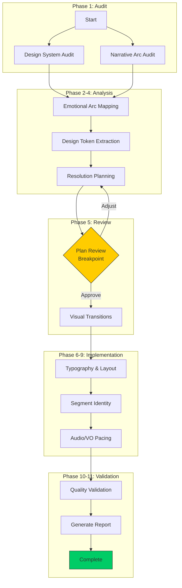

# Design & Narrative Coherence - Process Diagram



## Emotional Arc Target

```
Screen Progression
──────────────────────────────────────────────────────────────────▶

    ┌─────────────────────────────────────────────────────────────┐
    │                                                             │
Intensity                                                          │
    │      ╱╲    HUMOR         ╱╲                                │
    │     ╱  ╲   (Bachelor,   ╱  ╲   REFLECTION                   │
    │    ╱    ╲   Feud)      ╱    ╲   (Survivor,                  │
    │   ╱ TENSION ╲         ╱      ╲   Maury)                     │
    │  ╱  (Intro,  ╲_______╱ VULN   ╲__________ CATHARSIS        │
    │ ╱   Shark)            (Share)            (Credits)          │
    └─────────────────────────────────────────────────────────────┘

Target: tension → humor → reflection
```

## Task Dependencies

```
┌──────────────────────────────────────────────────────────────────┐
│ PARALLEL                                                          │
│  ┌─────────────────────┐  ┌─────────────────────┐                │
│  │ design-system-audit │  │ narrative-arc-audit │                │
│  └──────────┬──────────┘  └──────────┬──────────┘                │
│             └──────────────┬─────────┘                           │
│ SEQUENTIAL                 │                                      │
│                   ┌────────▼────────┐                            │
│                   │ emotional-arc-  │                            │
│                   │    mapping      │                            │
│                   └────────┬────────┘                            │
│                   ┌────────▼────────┐                            │
│                   │ design-token-   │                            │
│                   │   extraction    │                            │
│                   └────────┬────────┘                            │
│                   ┌────────▼────────┐                            │
│                   │ inconsistency-  │                            │
│                   │   resolution    │                            │
│                   └────────┬────────┘                            │
│                            │                                      │
│ BREAKPOINT        ┌────────▼────────┐                            │
│                   │  PLAN REVIEW    │                            │
│                   └────────┬────────┘                            │
│                            │                                      │
│ SEQUENTIAL        ┌────────▼────────┐                            │
│                   │ visual-         │                            │
│                   │ transition-fix  │                            │
│                   └────────┬────────┘                            │
│                   ┌────────▼────────┐                            │
│                   │ typography-     │                            │
│                   │ layout-fix      │                            │
│                   └────────┬────────┘                            │
│                   ┌────────▼────────┐                            │
│                   │ segment-        │                            │
│                   │ identity-fix    │                            │
│                   └────────┬────────┘                            │
│                   ┌────────▼────────┐                            │
│                   │ audio-vo-       │                            │
│                   │ pacing-fix      │                            │
│                   └────────┬────────┘                            │
│                   ┌────────▼────────┐                            │
│                   │ quality-        │                            │
│                   │ validation      │                            │
│                   └────────┬────────┘                            │
│                   ┌────────▼────────┐                            │
│                   │ generate-       │                            │
│                   │ report          │                            │
│                   └────────┬────────┘                            │
│                            │                                      │
│                            ▼                                      │
│                       COMPLETE                                    │
└──────────────────────────────────────────────────────────────────┘
```
