# Visual Polish Immersion Process - Flow Diagram

```mermaid
flowchart TD
    subgraph Phase1["Phase 1: Analysis"]
        A1[Start] --> A2[Analyze Current Visual State]
        A2 --> A3{Breakpoint: Review Analysis}
        A3 -->|All changes| P2
        A3 -->|Code only| P2
        A3 -->|Review| A2
    end

    subgraph Phase2["Phase 2: Code Changes (DESIGN.md Compliant)"]
        P2[Begin Code Changes] --> C1["Add hideTvFrame: true<br/>to screen objects"]
        C1 --> C2["Modify --surface CSS variable<br/>in globals.css"]
        C2 --> C3{Breakpoint: Test Changes}
        C3 -->|Continue| P3
        C3 -->|Pause| C4[Manual Testing]
        C4 --> P3
    end

    subgraph Phase3["Phase 3: Art Direction (Painterly Cinematic)"]
        P3[Establish Art Direction] --> AD1["Define painterly-cinematic style<br/>(NOT cartoon/arcade)"]
        AD1 --> AD2[Broadcast TV Color Palette]
        AD2 --> AD3[Cinematic Lighting Guidelines]
        AD3 --> AD4[Write Style Guide]
        AD4 --> AD5{Breakpoint: Approve Direction}
        AD5 -->|Approve| P4
        AD5 -->|Revise| AD1
    end

    subgraph Phase4["Phase 4: Asset Specs"]
        P4[Create Asset Specifications] --> S1[12 Background Specs]
        S1 --> S2[Brand Reveal Video Spec]
        S2 --> P5
    end

    subgraph Phase5["Phase 5: Character Fix (z-index Layering)"]
        P5[Analyze Stacking Context] --> F1{Issue Type?}
        F1 -->|Layout| F2["Set z-index values<br/>per layer structure"]
        F1 -->|Asset| F3["Separate PNG layers<br/>with transparency"]
        F1 -->|Both| F4["z-index + Layer Masks"]
        F2 --> F5{Breakpoint: Review Fix}
        F3 --> F5
        F4 --> F5
        F5 --> P6
    end

    subgraph Phase6["Phase 6: Verification"]
        P6[Verify Visual Quality] --> V1[Test hideTvFrame Logic]
        V1 --> V2[Test --surface Contrast]
        V2 --> V3[Test Brand Reveal]
        V3 --> V4[Test Layer Stacking]
        V4 --> V5{Score >= 80%?}
        V5 -->|Yes| V6[Success]
        V5 -->|No| V7{Breakpoint: Iterate?}
        V7 -->|Yes| P2
        V7 -->|No| V8[Complete with Issues]
    end

    style Phase1 fill:#e1f5fe
    style Phase2 fill:#fff3e0
    style Phase3 fill:#e8eaf6
    style Phase4 fill:#f3e5f5
    style Phase5 fill:#e8f5e9
    style Phase6 fill:#fce4ec
```



## Task Dependencies

```
analyze-current-state
    |
    v
+---+-------------------+
|                       |
v                       v
implement-frame-removal implement-darker-cards
(hideTvFrame: true)     (--surface CSS var)
|                       |
+----------+------------+
           |
           v
     art-direction (painterly-cinematic style guide)
           |
           v
    create-asset-specs (12 backgrounds + video)
           |
           v
 fix-character-positioning (z-index stacking)
           |
           v
   verify-visual-quality
```

## Breakpoints

| # | Phase | Question | Options |
|---|-------|----------|---------|
| 1 | Analysis | Review current state before proceeding? | All changes / Code only / Review |
| 2 | Code | Test hideTvFrame + --surface changes? | Continue / Pause |
| 3 | Art Direction | Approve painterly-cinematic style? | Approve / Revise |
| 4 | Character | How to handle z-index layering fix? | Apply / Asset / Skip |
| 5 | Complete | Accept results or iterate? | Accept / Iterate |

## Agents by Phase

| Phase | Agent | Specialization |
|-------|-------|----------------|
| 1 | visual-qa-scorer | UX/UI Design |
| 2 | nextjs-developer | Web Development |
| 2 | react-developer | Web Development |
| 3 | art-director-agent | Game Development |
| 4 | design-mock-analyzer | UX/UI Design |
| 5 | ui-implementer | UX/UI Design |
| 6 | visual-qa-scorer | UX/UI Design |

## Asset Coverage

**Backgrounds (12) — Painterly Cinematic Style:**
- intro-retro-tv, cold-open-glitch, morning-desk
- feud-board (4 screens), sponsor-pedestal (2 screens)
- bachelor-mansion (2 screens), limo-interior
- shark-warehouse (2 screens), tribal-council
- maury-studio, control-room, credits-bg (2 screens)

**Videos (1 new):**
- commercial-break.mp4 (brand reveal)

**Textures (review):**
- paper-grain-tile.png (may need adjustment for painterly style)

## DESIGN.md Constraints Applied

| Aspect | Constraint | Implementation |
|--------|------------|----------------|
| Frame removal | Data-driven, not index-based | `hideTvFrame: true` in screen objects |
| Card contrast | Semantic CSS variables | Modify `--surface` in globals.css |
| Art style | Cinematic broadcast TV | Painterly-cinematic, NOT cartoon/arcade |
| Character layering | z-index stacking context | Explicit layer structure with z-index values |
